# Integración y Análisis de Calidad de Código con SonarQube

## 📌 Descripción General
Este repositorio documenta un flujo de trabajo profesional centrado en la configuración, integración e implementación de **SonarQube** para la inspección continua de la calidad del código, detección de *bugs* y la identificación de vulnerabilidades (SAST). 

El objetivo principal es demostrar un enfoque robusto y estandarizado aplicable a entornos empresariales reales, garantizando así un ciclo de vida de desarrollo de software (SDLC) seguro y mantenible.

## 🎯 Objetivos del Proyecto
* **Análisis de Código Estático:** Integrar SonarQube para revisar la salud de base de código.
* **Trazabilidad y Documentación:** Registrar meticulosamente cada comando, error y solución encontrados durante la configuración.
* **Calidad a Nivel de Producción:** Establecer *Quality Gates* (Puertas de Calidad) y umbrales estrictos.
* **Portafolio Profesional:** Servir como referencia técnica de habilidades en metodologías DevSecOps para contrataciones.

---

## 🛠️ Registro de Actividades e Implementación

En esta sección se detallará cronológicamente cada paso realizado para desplegar y utilizar SonarQube, incluyendo evidencias técnicas de cada fase.

### Fase 1: Inicialización del Repositorio y Documentación

**Fecha de inicio:** Marzo 2026

Se comienza con la inicialización del repositorio y la creación de la estructura base para la documentación del proyecto.

*Nota: Esta sección se actualizará continuamente a medida que avancemos con la instalación, escaneo de repositorios y resolución de vulnerabilidades.*

### Fase 2: Instalación y Configuración en Kali Linux (VM)

Para asegurar un entorno de análisis aislado y controlado, la infraestructura de SonarQube se despliega sobre una máquina virtual (VM) equipada con **Kali Linux**. Esta decisión aprovecha su ecosistema orientado a la seguridad ofensiva y defensiva.

#### 1. Requisitos Previos Habituales
Recomendamos actualizar paquetes básicos en la VM e instalar las dependencias necesarias:

```bash
sudo apt update && sudo apt upgrade -y
```

#### 3. Instalación de Docker y Docker Compose
Dado que optamos por un despliegue contenerizado (la mejor práctica para aislamiento y facilidad de mantenimiento), instalamos Docker y su orquestador de contenedores en la máquina virtual:

```bash
sudo apt install docker.io docker-compose -y
```

#### 4. Habilitar y Arrancar el Servicio de Docker
Para asegurar que el demonio de Docker se inicie de forma automática con el sistema y arranque inmediatamente en la sesión actual, ejecutamos:

```bash
sudo systemctl enable docker --now
```

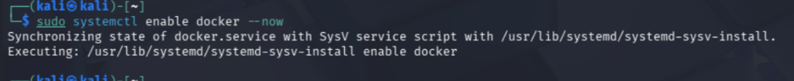
*Resultado de la habilitación del servicio Docker en el sistema.*

### Fase 3: Preparación del Código de Prueba (Vulnerable)

Para demostrar la efectividad de **SonarQube** detectando diferentes tipos de problemas en fases tempranas del ciclo de vida (SAST), se ha desarrollado un pequeño script en Python (`vulnerable.py`) que contiene tres tipos de incidencias diferentes: vulnerabilidades, bugs de lógica, y *code smells* (código sucio).

#### Código Fuente (`vulnerable.py`)
El script implementa una funcionalidad ficticia con varios errores claros a propósito:

```python
def funcion_trampa():
    # 1. VULNERABILIDAD (Hardcoded credential)
    password = "admin_password_123"
    # 2. CODE SMELL (Variable no usada)
    variable_inutil = 42
    # 3. BUG LÓGICO (Código inalcanzable)
    return True
    print("Esto nunca se ejecutará " + password)

funcion_trampa()
```

> **🛡️ Contexto de Seguridad y Calidad:** Este simple fragmento disparará tres alertas distintas en SonarQube:
> 1. **Vulnerability:** Almacenamiento de contraseñas *hardcodeadas* directamente en código fuente (altamente crítico).
> 2. **Code Smell:** Declaración de variables que luego nunca se usan, lo que ensucia y confunde en mantenimientos futuros.
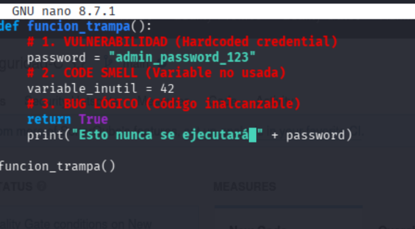
*Script `vulnerable.py` editado con Nano, mostrando incidencias de seguridad y calidad.*

### Fase 4: Despliegue de SonarQube

Para levantar la instancia de **SonarQube**, procedemos a descargar la imagen oficial y desplegarla en un contenedor de Docker ejecutándose en segundo plano (`-d` o detached mode). Hemos seleccionado la versión *Long-Term Support (lts-community)* por ser gratuita y la más estable para entornos de producción corporativos. Python, al ser un lenguaje soportado nativamente por la edición *Community*, nos permitirá realizar este SAST sin requerir licencias adicionales.

Ejecutamos el siguiente comando en la máquina virtual:

```bash
sudo docker run -d --name sonarqube -p 9000:9000 sonarqube:lts-community
```

* **`-d`**: Ejecuta el contenedor en segundo plano.
* **`--name sonarqube`**: Asigna un nombre claro y descriptivo al contenedor para facilitar su gestión posterior.
* **`-p 9000:9000`**: Expone el panel de control web de SonarQube hacia el anfitrión en el puerto 9000.
* **`sonarqube:lts-community`**: Etiqueta de la imagen oficial mantenida por SonarSource (versión comunitaria LTS).
Una vez que el contenedor termine de levantar todos los procesos (como el motor de Elasticsearch interno y la web DB), la interfaz estará disponible navegando a `http://localhost:9000` o la IP de tu VM (`http://<IP_KALI>:9000`).

#### Solución de Problemas: Límite de Memoria Virtual
Es altamente probable que durante el arranque del contenedor, el motor de **Elasticsearch** (integrado en SonarQube) falle y el contenedor se detenga (`Exited (78)` o similar). Esto se debe a que las medidas estandarizadas del kernel en distribuciones como Kali Linux son insuficientes para la indexación rápida.

Para solventarlo y permitir que SonarQube inicie correctamente, aplicamos el siguiente ajuste a los límites de áreas de memoria virtual mapeadas (*mmap*), una configuración obligatoria en entornos de producción:

```bash
sudo sysctl -w vm.max_map_count=262144
```

> **💡 Nota:** Después de aplicar este comando, el contenedor podrá arrancar con normalidad (puedes verificarlo con `docker logs sonarqube` o reiniciando el contenedor si se había parado con `docker start sonarqube`).

### Fase 5: Configuración de Seguridad y Accesos en la Interfaz Web

Una vez que comprobamos que el puerto está sirviendo correctamente, accedemos a la consola web para establecer las bases de seguridad del entorno:

1. **Autenticación Inicial:**
Nos dirigimos a `http://localhost:9000` (o a la IP correspondiente de la VM) e iniciamos sesión con las credenciales predeterminadas de SonarSource:
    * **Usuario:** `admin`
    * **Contraseña:** `admin`

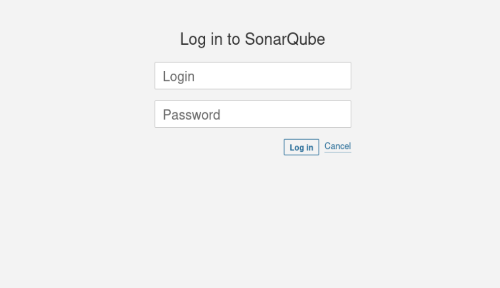
*Pantalla de inicio de sesión estándar de SonarQube.*

2. **Refuerzo de Credenciales:**
Como dicta cualquier buena política de seguridad, la plataforma fuerce inmediatamente el cambio de la contraseña por defecto. Reemplazamos la contraseña por una fuerte y segura.

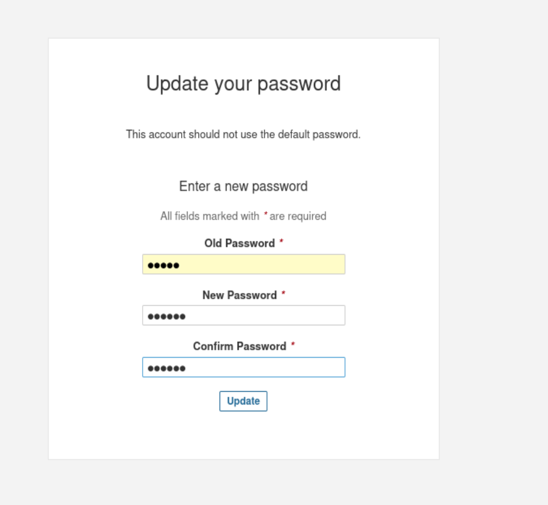
*Proceso de cambio de contraseña del administrador.*

3. **Generación de Token de Acceso (Best Practice):**
Evitaremos utilizar el combo de usuario/contraseña para enviar los reportes de análisis de código (práctica totalmente desaconsejada en CI/CD y automatizaciones). En su lugar, generaremos un Token de Autenticación de Usuario:
    * Nos dirigimos a **Administration > Security > Users**.
    * Seleccionamos la opción **Tokens** sobre nuestro usuario.
    * Generamos un *User Token* nombrándolo `Vulnerabilidades`.

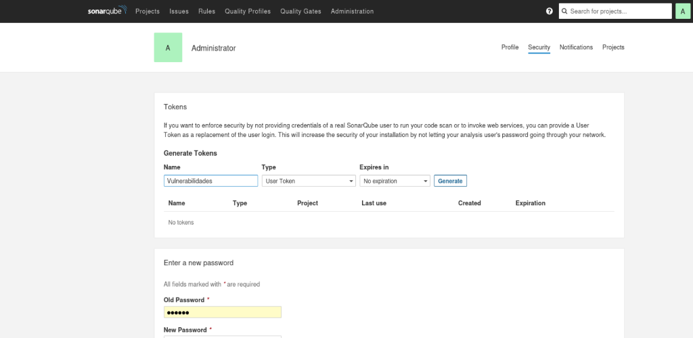
*Panel de administración de tokens de seguridad y accesos.*

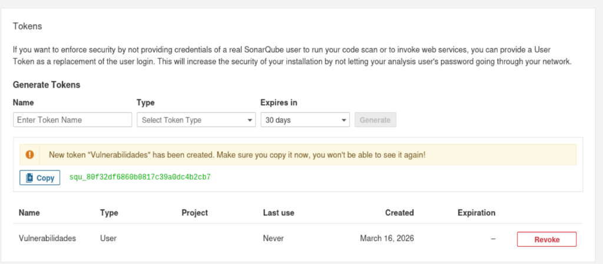
*Token generado con éxito.*

### Fase 6: Análisis de Código Estático (SAST) mediante SonarScanner

Con la plataforma preparada y asegurada, ejecutaremos **SonarScanner CLI**, la herramienta oficial encargada de recolectar el código fuente, parsearlo, y enviar la metadata al servidor de SonarQube para buscar vulnerabilidades. 

Lo haremos también mediante un contenedor efímero de Docker (`--rm`), manteniendo el entorno limpio sin necesidad de instalar el binario Java del *scanner* localmente en el host. 

Estando ubicados en el directorio donde creamos nuestro archivo `vulnerable.py`, ejecutamos:

```bash
sudo docker run --rm \
    --network host \
    -v "$(pwd):/usr/src" \
    sonarsource/sonar-scanner-cli \
    -Dsonar.projectKey=Analisis-Seguridad-C \
    -Dsonar.sources=. \
    -Dsonar.host.url=http://localhost:9000 \
    -Dsonar.login=squ_80f32df6860b0817c39a0dc4b2cb7f1d88a27873 \
    -Dsonar.python.version=3 \
    -Dsonar.scm.disabled=true
```

**Análisis del Comando Docker:**
* **`--rm`**: Elimina el contenedor instantáneamente en cuanto finaliza el análisis, ahorrando almacenamiento.
* **`--network host`**: Permite al contenedor del *scanner* acceder cómodamente a `localhost:9000` (donde escucha nuestro servidor de SonarQube previamente desplegado).
* **`-v "$(pwd):/usr/src"`**: Monta nuestro directorio actual donde está el código fuente dentro del contenedor.
* **`-Dsonar.projectKey`**: Define el identificador único de nuestro proyecto en el servidor de SonarQube (`Analisis-Seguridad-C`).
* **`-Dsonar.sources=.`**: Le dice a SonarScanner qué archivos inspeccionar (en este caso el directorio actual `.` que acabamos de montar en el volumen).
* **`-Dsonar.login=...`**: En lugar de contraseñas crudas en bash, hacemos uso del Token generado en la *Fase 5* para autenticarnos de forma robusta.
* **`-Dsonar.python.version=3`**: Obliga al analizador de Python a utilizar las reglas y sintaxis de Python 3.
* **`-Dsonar.scm.disabled=true`**: Desactiva el chequeo de Control de Archivos (SCM/Git), muy útil si estás analizando código desde una carpeta que aún no se ha inicializado como repositorio local de Git (evita errores `blame`).

### Fase 7: Creación de Quality Profile y Activación de Reglas SAST Específicas

Para garantizar que SonarQube detecte con precisión inyecciones de comandos (OS Command Injection) o SQL Injections, necesitamos asegurar que las reglas correspondientes estén activadas. Por defecto, SonarQube utiliza el perfil *"Sonar way"*, pero crearemos uno personalizado para forzar la activación de las vulnerabilidades más críticas.

1. **Creación del Perfil Personalizado:**
Navegamos a la pestaña **Quality Profiles** en el menú superior. Creamos un nuevo perfil para el lenguaje **Python**:
    * **Name:** `Vulnerabilidades`
    * **Language:** `Python`
    * **Profile to extend:** `Sonar way (Built-in)` (esto hereda las reglas estándar y nos permite añadir nuevas).

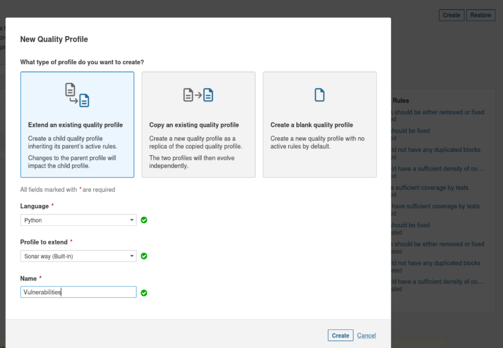
*Creación de un nuevo Quality Profile extendiendo el predeterminado.*

2. **Activación de Reglas de Inyección (OS Command & SQL):**
Dentro del nuevo perfil `Vulnerabilidades`, hacemos clic en el botón **"Activate More"** situado debajo de las estadísticas de reglas activas/inactivas.

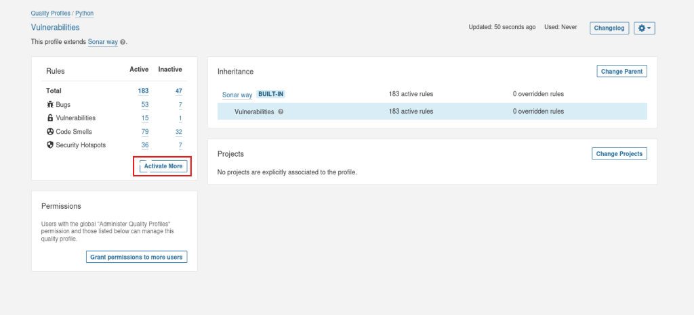
*Acceso al buscador de reglas inactivas para habilitarlas en nuestro perfil.*

En la barra de búsqueda de reglas ingresamos los siguientes términos y pulsamos **"Activate"** en las reglas de Python que aparezcan:
* `OS command injection` (buscando aquellas que mencionen dependencias como `os.system` o `subprocess`).
* `SQL injection` (para prevenir futuros fallos en consultas a bases de datos).

3. **Establecer como Perfil por Defecto:**
Una vez activadas las reglas necesarias, debemos asegurarnos de que SonarScanner utilice este perfil de forma automática para todos los proyectos de Python. En la lista principal de *Quality Profiles*, hacemos clic en el engranaje junto al perfil `Vulnerabilidades` y seleccionamos **"Set as Default"**.

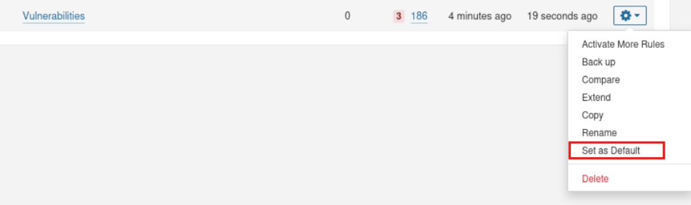
*Configuración del nuevo perfil extendido como el predeterminado para el análisis de código Python.*

De esta manera, hemos blindado nuestra configuración, asegurándonos de que nuestro script `vulnerable.py` sea auditado con el mayor rigor posible.

### Fase 8: Revisión de Resultados y Quality Gates

Tras la ejecución del contenedor de `sonar-scanner-cli`, los resultados se envían automáticamente a nuestro servidor web de SonarQube, procesándose en tiempo real. Al abrir la pestaña de nuestro proyecto en el *Dashboard* principal, visualizaremos la auditoría crítica que evidencia los problemas insertados en la *Fase 3*:

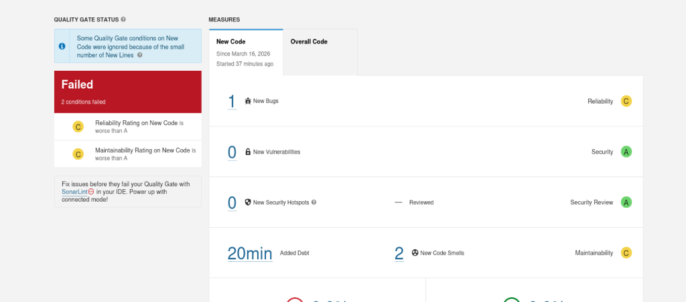
*Dashboard principal del proyecto mostrando el incumplimiento del Quality Gate.*

**Análisis Técnico del Reporte (Métricas Clave):**

1. ❌ **Quality Gate "Failed":**
   El estado general del escaneo es **"Failed"** (representado por el recuadro rojo). A nivel empresarial, este es el indicador más crítico (*Go/No-Go*). Significa que el código subido **no cumple con los estándares mínimos de calidad y seguridad** definidos por la organización, impidiendo y bloqueando automáticamente su paso a producción en una pipeline automatizada (CI/CD).

2. 🐛 **1 New Bug (Reliability Rating - C):**
   El motor de análisis semántico ha detectado el fallo lógico introducido (la cláusula `print()` situada después del bloque `return True`). Esto pone de manifiesto que SonarQube posee *Control Flow Analysis* preciso: no solo entiende la sintaxis, sino la lógica de ejecución del lenguaje, alertando de que ese bloque de código es inalcanzable (Dead Code).

3. ☢️ **2 New Code Smells (Maintainability Rating - C):**
   Ha localizado anti-patrones de diseño y código "sucio". Por ejemplo, la declaración de `variable_inutil = 42` que jamás se emplea. Las reglas de mantenibilidad aseguran que el código sea limpio y legible para refactorizaciones futuras.

4. ⏱️ **Added Debt (20min):**
   SonarQube calcula y cuantifica de forma automática la **Deuda Técnica** del proyecto. La estimación indica que a un ingeniero de software le tomaría aproximadamente 20 minutos entender y parchear todos estos fallos (eliminar variables, arreglar el flujo de control, solucionar contraseñas estáticas, etc.) para que el código quede conforme al nivel "A" exigible. Esta métrica es fundamental en desarrollo *Agile* para planificar *sprints* de refactorización.

### Fase 9: Remediación y Validación del Quality Gate (Passed)

El ciclo de DevSecOps no termina en encontrar el fallo, sino en parchearlo y verificar que el software ya es seguro para su despliegue. Procedemos a refactorizar nuestro script `vulnerable.py`, aplicando los principios de código seguro que SonarQube nos exigía:

#### Código Refactorizado (`vulnerable.py`)
```python
import os

def funcion_segura():
    # 1. REMEDIACIÓN VULNERABILIDAD: Nunca hardcodear contraseñas.
    # Usamos variables de entorno (environment variables).
    password_segura = os.environ.get("DB_PASSWORD", "no_configurada")
    
    # 2. REMEDIACIÓN CODE SMELL: Eliminada la variable inútil.
    
    # 3. REMEDIACIÓN BUG LÓGICO: Arreglado el orden del 'return' para no dejar código muerto.
    if password_segura != "no_configurada":
        print("Autenticación configurada de forma segura.")
        return True
        
    print("Falta configurar la variable de entorno de la contraseña.")
    return False

funcion_segura()
```

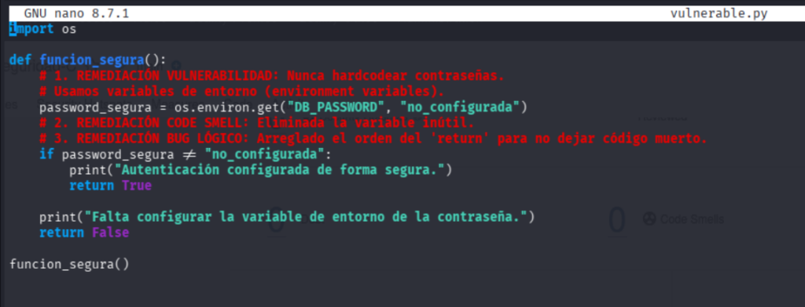
*Código fuente modificado, habiendo eliminado las credenciales embebidas, el bloque inalcanzable y los anti-patrones.*

Una vez aplicados los cambios en el archivo, ejecutamos nuevamente el contenedor de `sonar-scanner-cli` con el mismo comando exacto de la *Fase 6*. El escáner reevaluará el proyecto completo y enviará el nuevo *commit* de análisis al servidor:

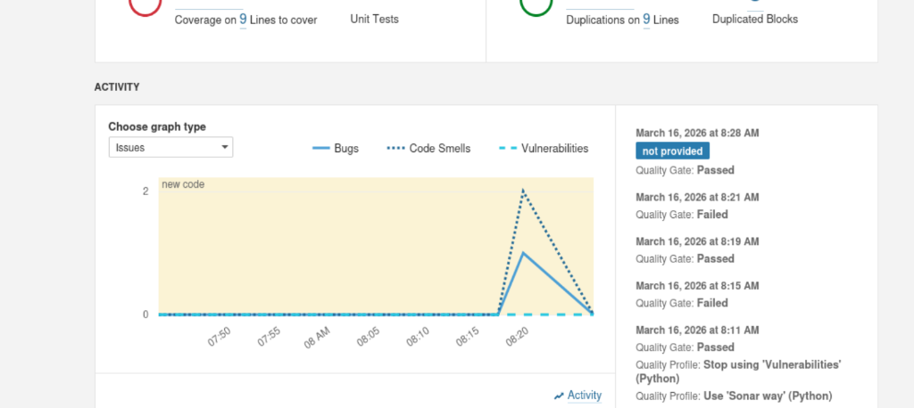
*Historial de Actividad del proyecto en SonarQube.*

**Análisis de la Remediación:**
Como podemos observar en el gráfico de actividad (Activity Graph), las líneas que marcaban incidencias (Bugs en azul claro y Code Smells en línea de puntos azul oscuro) han **caído drásticamente a cero** en el último registro horario. 

El panel de la derecha confirma el hito: **Quality Gate: Passed**.
Nuestro código ahora sí cumple con la normativa de calidad, es mantenible (Deuda Técnica eliminada) y es completamente seguro (0 vulnerabilidades), permitiendo que la *pipeline* automática diera luz verde para hacer un despliegue seguro a los entornos de producción.

---

## Conclusiones y Valor Añadido

Este proyecto no es solo una prueba técnica de una herramienta; es una implementación práctica de la filosofía **Shift-Left Security**. Al integrar el análisis estático de código (SAST) en las primeras fases del desarrollo, las empresas obtienen:

1.  **Reducción de Costes:** Es hasta 100 veces más barato corregir una vulnerabilidad en fase de desarrollo que tras un incidente de seguridad en producción.
2.  **Estandarización de Calidad:** Asegura que todo el código del equipo mantenga un estilo y seguridad homogéneo mediante la aplicación de *Quality Profiles* y *Quality Gates*.
3.  **Cumplimiento Normativo:** Facilita el cumplimiento de estándares como ISO 27001 o GDPR al demostrar procesos activos de revisión de seguridad.

### Habilidades Técnicas Demostradas (para CV/Portfolio)

*   **DevSecOps:** Implementación de auditorías de seguridad automáticas en el ciclo de vida del software.
*   **Virtualización y Contenedores:** Despliegue de infraestructura compleja (SonarQube + Elasticsearch + DB) mediante **Docker** y gestión de límites del Kernel en Linux.
*   **Análisis SAST:** Configuración avanzada de motores de reglas estáticas, creación de perfiles de calidad personalizados y establecimiento de umbrales de seguridad (*Quality Gates*).
*   **Python Security:** Conocimiento de vulnerabilidades comunes (Hardcoded secrets, Inyecciones, Dead Code) y técnicas de remediación segura (Environment Variables, refactorización lógica).
*   **Troubleshooting:** Resolución de problemas de performance y memoria en entornos virtualizados (VM Kali Linux).

---
*Este repositorio ha sido documentado con fines profesionales para demostrar capacidades técnicas en auditoría de código y seguridad ofensiva/defensiva.*
